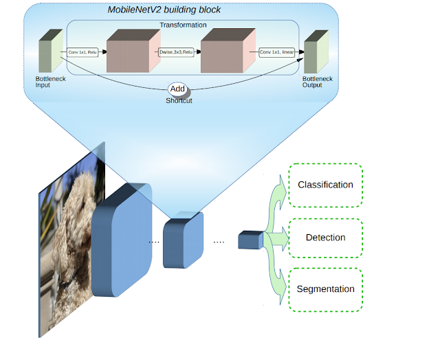
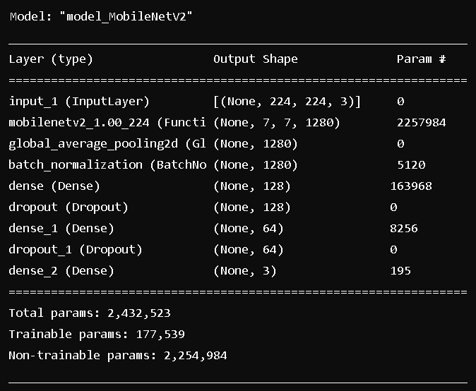
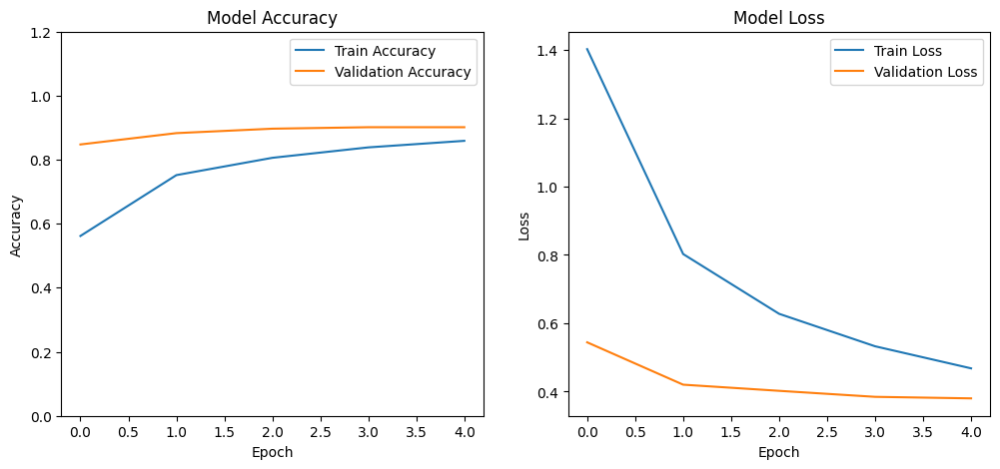
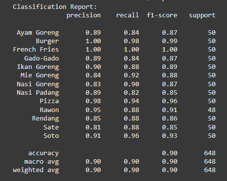

# UAP Machine Learning : Klasifikasi Makanan Indonesia dengan MobileNetV2 dan VGG19

##Overview Project
Proyek ini bertujuan untuk mempermudah masyarakat maupun wisatawan yang berkunjung ke Indonesia. Mereka bisa memanfaatkan sistem ini untuk membedakan apakah makanan ini khas Indonesia atau bukan berdasarkan keterangan. Sistem klasifikasi ini dapat mengenali dan membedakan yang termasuk dalam macam-macam makanan Indonesia ini atau bukan seperti "ayam goreng", "ayam goreng","burger", "frech fries", "Gado-Gado", "Ikan goreng", "Mie goreng", "Nasi goreng", "nasi padang", "Pizza", "Rawon", "rendang", "sate", "soto".

link Dataset yang digunakan [MAKANAN INDONESIA](https://www.kaggle.com/datasets/rizkyyk/dataset-food-classification)

Model yang digunakan: ***Mobile NetV2*** dengan 3 Layer dan Pre Trained Model ***VGG19*** dengan Architecture Model kurang lebih seperti gambar berikut.

**Mobile Net Architecture** 

**VGG19 Architecture** 

## Overview Dataset
Dataset yang digunakan adalah RPS Dataset dengan link sebagai [berikut]([https://www.kaggle.com/datasets/rizkyyk/dataset-food-classification]). Dataset terdiri atas 6500 data yang terbagi menjadi 500 setiap kategorinya dan 25.965 data sebagai *Training Set*, 650 data sebagai *Validation Set*, dan 648 data sebagai *Testing Set*, dimana pada setiap Set, terdapat 13 Label Class yaitu *"ayam goreng", "ayam goreng","burger", "frech fries", "Gado-Gado", "Ikan goreng", "Mie goreng", "Nasi goreng", "nasi padang", "Pizza", "Rawon", "rendang", "sate", "soto".*. 

## Preprocessing & Modelling

### MobileNetV2
**Preprocessing**
Preprocesing yang dilakukan adalah *resize***(224,224)**, lalu *rescale / normalization* dengan rentang **1./255**, dan Augmentation untuk menghasilkan dataset yang sesuai lalu dilakukan split data menjadi 3 *(Training, Validation, dan Testing)* sesuai dengan penjelasan pada Dataset.

Hasil dari MobileNetV2 Model yang telah dibangun adalah sebagai berikut :

**Model Evaluation**

Berikut adalah hasil dari fitting  MobileNetV2 yang telah dibangun :

Plot diatas menunjukkan bahwa 

Gambar diatas merupakan *Classification Report* dari Model setelah dilakukan *predict* terhadap *Testing Set*. Dapat dilihat bahwa Akurasinya mencapai **90%**
